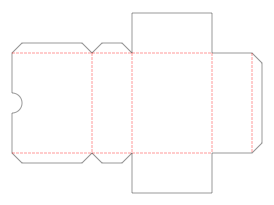
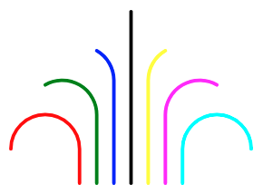
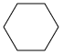
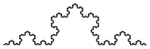

# svg-turtle #

a turtle graphics library with SVG output

`svg-turtle` is a small JavaScript library (written in TypeScript) to create [turtle graphics](https://en.wikipedia.org/wiki/Turtle_graphics) with [SVG](https://en.wikipedia.org/wiki/Scalable_Vector_Graphics) output. While it may well be used to create "ordinary" graphics, it is primarily intended to create projects for cutting plotters.



**(this project is currently under active development, please stay tuned - it is planned to be finished by end of July)**

**NPM users**: please consider the [Github README](https://github.com/rozek/svg-turtle/blob/main/README.md) for the latest description of this package (as updating the docs would otherwise always require a new NPM package version)

> Just a small note: if you like this module and plan to use it, consider "starring" this repository (you will find the "Star" button on the top right of this page), so that I know which of my repositories to take most care of.

## Installation ##

`svg-turtle` may be used as an ECMAScript module (ESM), a CommonJS or AMD module or from a global variable.

You may either install the package into your build environment using [NPM](https://docs.npmjs.com/) with the command

```
npm install svg-turtle
```

or load the plain script file directly

```html
<script src="https://unpkg.com/svg-turtle"></script>
```

## Access ##

How to access the package depends on the type of module you prefer

* ESM (or Svelte): `import { Graphic } from 'svg-turtle'`
* CommonJS: `const SVGTurtle = require('svg-turtle')`
* AMD: `require(['svg-turtle'], (SVGTurtle) => {...})`

Alternatively, you may access the global variable `SVGTurtle` directly.

## Usage within Svelte ##

For Svelte it is recommended to import the package within a module context:

```html
<script context="module">
  import Graphic from 'svg-turtle'
</script>

<script>
  let SVG = new Graphic().moveTo(10,10).draw(10).curveRight(90,10).draw(10).asSVG()
</script>
```

## Usage as ECMAscript Module ##

If you prefer ESMs, just import the library and use it:

```html
<script>
  import { Graphic } from 'svg-turtle'

  window.onload = function () {
    let SVG = new Graphic().moveTo(10,10).draw(10).curveRight(90,10).draw(10).asSVG()
    ...
  }
</script>
```

## Usage as CommonJS or AMD Module (or as a global Variable) ##

Let's assume that you already "required" or "imported" (or simply loaded) the module according to your local environment. In that case, you may use it as follows:

```html
<script>
  const { Graphic } = SVGTurtle

  window.onload = function () {
    let SVG = new Graphic().moveTo(10,10).draw(10).curveRight(90,10).draw(10).asSVG()
    ...
  }
</script>
```

## Example ##

A [simple example](https://svelte.dev/repl/e3d91abc0a3d4a6fb2204b8e756e3b3c) is available on the Svelte REPL - feel free to play with it!



More examples can be found [below](#further-examples).

## API Reference ##

As shown in the code examples above, every graphic is represented by an instance of class `Graphic` - each of which may contain multiple "paths".

A **typical workflow** looks as follows:

* create an instance of class `Graphic`,
* define one or multiple "paths",
* render the instance as SVG - if need be, with proper scaling for cutting plotters

### exported Types ###

* **`type TUR_Location = number`**<br>represents an optionally signed finite number to be used as an x or y coordinate
* **`type TUR_Dimension = number`**<br>represents a finite number ≥ 0 to be used as a dimension (i.e., width or height)
* **`type TUR_Angle = number`**<br>represents an optionally signed finite number to be used as an angle (given in degrees, positive values rotate clockwise, negative ones counterclockwise)
* **`type TUR_Color = string`**<br>represents a literal CSS/SVG-compliant color specification (such as "red" or "#FF0000")
* **`type TUR_Lineature = 'solid'|'dotted'|'dashed'`**<br>represents a specifies line type
* **`type TUR_Join = 'bevel'|'miter'|'round'`**<br>represents a line join type
* **`type TUR_Cap = 'butt'|'round'|'square'`**<br>represents a line end type
* **`type TUR_PathOptionSet = {`**<br>
  &nbsp; **`x?:TUR_Location, y?:TUR_Location, Direction?:TUR_Angle,`**<br>
  &nbsp; **`Width?:TUR_Dimension, Color?:TUR_Color,`**<br>
  &nbsp; **`Lineature?:TUR_Lineature, Join?:TUR_Join, Cap?:TUR_Cap`**<br>
  **`}`**<br>represents a set of options which may be used to initialize a new path
* **`type TUR_Position = { x:TUR_Location, y:TUR_Location }`**<br>represents a position of the turtle, given by its x and y coordinates - but whithout specifying its orientation
* **`type TUR_Alignment = { x:TUR_Location, y:TUR_Location, Direction:TUR_Angle }`**<br>represents a position and orientation of the turtle, given by its x and y coordinates and its orientation measured in degrees against the x-axis (positive values describe a clockwise, negative ones a counterclockwise rotation)

### Class Graphic ###

Class `Graphic` has a single parameterless constructor. After instantiation (or, later, after a `reset`), its settings contain the following defaults:

* `x,y`: `0,0` (at coordinate origin)
* `Direction`: `0` (in direction of the x-axis)<br>&nbsp;
* `Width`: 1
* `Color`: `#000000`
* `Lineature`: `solid`
* `Join`: `round`
* `Cap`: `round`

Many methods return the instance they were applied to in the end - this may be used to immediately concatenate multiple method invocations (sometimes called a **fluent API**)

* **`reset ():Graphic`**<br>sets turtle position, orientation and line properties to their defaults (as shown above)
* **`beginPath (PathOptionSet?:TUR_PathOptionSet):Graphic`**<br>starts a new path, beginning with the current turtle position,  orientation and line properties, optionally overwritten by any settings given in `PathOptionSet`
* **`turn (Anglee:TUR_Angle):Graphic`**<br>rotates the turtle relative to its current direction by the given `Angle` (specified in degrees). Positive angles rotate clockwise, negative ones counterclockwise. This method may be invoked outside an active path
* **`turnTo (Angle:TUR_Angle):Graphic`**<br>rotates the turtle "absolutely" (i.e. relative to the x-axis) to the given `Angle` (specified in degrees). Positive angles describe a clockwise, negative ones a counterclockwise rotation. This method may be invoked outside an active path
* **`turnLeft (Angle:TUR_Angle):Graphic`**<br>rotates the turtle counterclockwise by the given `Angle` (specified in degrees), equivalent to `turn(-Angle)`. This method may be invoked outside an active path
* **`turnRight (Angle:TUR_Angle):Graphic`**<br>rotates the turtle clockwise by the given Angle (specified in degrees). This method is just a synonym for `turn(Angle)`. It may be invoked outside an active path
* **`move (Distance:TUR_Location):Graphic`**<br>moves the turtle "relatively" (i.e., starting from its current position) in the current direction for `Distance` units without drawing. Positive values for `Distance` move forward, negative ones move backward. This method may be invoked outside an active path
* **`moveTo (x:TUR_Location, y:TUR_Location):Graphic`**<br>moves the turtle "absolutely" (i.e., measured from the origin) to the given position (keeping its current orientation) without drawing. This method may be invoked outside an active path
* **`draw (Distance:TUR_Location):Graphic`**<br>moves the turtle "relatively" (i.e., starting from its current position) in the current direction for `Distance` units drawing a straight line. Positive distances move forward, negative ones backward. If invoked outside an active path, a new path with the current turtle position, orientation and line style is started
* **`drawTo (x:TUR_Location, y:TUR_Location):Graphic`**<br>moves the turtle "absolutely" (i.e., measured from the origin) to the given position (keeping its current orientation) drawing a straight line. If invoked outside an active path, a new path with the current turtle position, orientation and line style is started
* **`curveLeft (Angle:TUR_Angle, rx:TUR_Dimension, ry?:TUR_Dimension):Graphic`**<br>*(moves the turtle drawing a counterclockwise circular or elliptical arc for the given angle with radius rx in the current direction and ry perpendicular to the current direction (if given, otherwise defaults to rx), positive angles move turtle forward, negative angles move it backward, turtle is finally positioned at the end of the arc and oriented tangentially to the arc, if invoked outside an active path, a new path with the current turtle position, orientation and line style is started)*
* **`curveRight (Angle:TUR_Angle, rx:TUR_Dimension, ry?:TUR_Dimension):Graphic`**<br>*(moves the turtle drawing a clockwise circular or elliptical arc for the given angle with radius rx in the current direction and ry perpendicular to the current direction (if given, otherwise defaults to rx), positive angles move turtle forward, negative angles move it backward, turtle is finally positioned at the end of the arc and oriented tangentially to the arc, if invoked outside an active path, a new path with the current turtle position, orientation and line style is started)*
* **`endPath ():Graphic`**<br>*(ends the currently active path, if any, idempotent)*
* **`closedPath ():Graphic`**<br>*(closes the currently active path, if any, drawing a straight line and then ends the path, idempotent)*
* **`currentPosition ():TUR_Position`**<br>*(returns the current turtle position, may be used to explicitly move turtle to this position later)*
* **`positionAt (Position:TUR_Position):Graphic`**<br>*(moves the turtle to the given position without changing its direction)*
* **`currentAlignment ():TUR_Alignment`**<br>*(returns the current turtle position and orientation, may be used to explicitly move turtle to this position later)*
* **`alignAt (Alignment:TUR_Alignment):Graphic`**<br>*(moves the turtle to the given position and changes its direction)*
*  **`Limits ():{ xMin:number, yMin:number, xMax:number, yMax:number}`**<br>*(returns current estimated viewport limits)*
* **`public asSVG (`**<br>
  &nbsp; **`Unit?:'px'|'mm'|'cm'|'in',`**<br>
  &nbsp; **`xMin?:number,yMin?:number, xMax?:number,yMax?:number`**<br>
  **`):string`**<br>*(returns SVG code for given Graphic instance, estimates viewport from defined paths, xMin, xMax, yMin and yMax may be used to explicitly set viewport limits, viewport size is rendered using the given unit (which defaults to "px")*
* **`public asSVGwith72dpi (`**<br>
  &nbsp; **`Unit?:'px'|'mm'|'cm'|'in',`**<br>
  &nbsp; **`xMin?:number,yMin?:number, xMax?:number,yMax?:number`**<br>
  **`):string`**<br>*(like "asSVG" but scales output such that numbers are multiples of 1/72 inch (depending on the given unit which defaults to "mm")*

## Usage with "Cricut Design Space" ##

The "Cricut Design Space" does not respect any units given in an SVG's `width` and `height` attributes but expects the numeric coordinates to be multiples of 1/72 of an inch. It is therefore recommended to export any turtle graphics using the `asSVGwith72dpi` method which scales the output as required by the application (based on the provided unit).

*(upload SVG, place on canvas, "ungroup" into separate paths, select paths and assign tools, if need be: duplicate and align - e.g., for multiple scoring rounds, attach all paths again for proper positioning on mat)*

## Further Examples ##

All of them can be found on the Svelte REPL - ready to play with!

<table><tbody>
  <tr>
    <td></td>
    <td></td>
    <td></td>
  </tr>
  <tr>
    <td><a href="https://svelte.dev/repl/a1cbbe486cc14b059e3928841df647ae">Hexagon</a></td>
    <td><a href="https://svelte.dev/repl/6069788738e94544bb2b0adc014fa45a">Star</a></td>
    <td><a href="https://svelte.dev/repl/eb2d4448c73a4f57998982d6d7f64e9e">Koch Curve</a></td>
  </tr>
</tbody></table>

## Build Instructions ##

You may easily build this package yourself.

Just install [NPM](https://docs.npmjs.com/) according to the instructions for your platform and follow these steps:

1. either clone this repository using [git](https://git-scm.com/) or [download a ZIP archive](https://github.com/rozek/svg-turtle/archive/refs/heads/main.zip) with its contents to your disk and unpack it there 
2. open a shell and navigate to the root directory of this repository
3. run `npm install` in order to install the complete build environment
4. execute `npm run build` to create a new build

You may also look into the author's [build-configuration-study](https://github.com/rozek/build-configuration-study) for a general description of his build environment.

## License ##

[MIT License](LICENSE.md)

