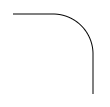

# svg-turtle #

a turtle graphics library with SVG output

`svg-turtle` is a small JavaScript library (based on TypeScript) to create [turtle graphics](https://en.wikipedia.org/wiki/Turtle_graphics) with [SVG](https://en.wikipedia.org/wiki/Scalable_Vector_Graphics) output. While it may well be used to create "ordinary" graphics, it is primarily intended to create projects for cutting plotters.

**(this project is currently under active development, please stay tuned - it is planned to be finished by end of July)**

**NPM users**: please consider the [Github README](https://github.com/rozek/svg-turtle/blob/main/README.md) for the latest description of this package (as updating the docs would otherwise always require a new NPM package version)

> Just a small note: if you like this module and plan to use it, consider "starring" this repository (you will find the "Star" button on the top right of this page), so that I know which of my repositories to take most care of.

## Installation ##

`svg-turtle` may be used as an ECMAScript module (ESM), a CommonJS or AMD module or from a global variable.

You may either install the package into your build environment using [NPM](https://docs.npmjs.com/) with the command

```
npm install svg-turtle
```

or load the plain script file directly

```html
<script src="https://unpkg.com/svg-turtle"></script>
```

## Access ##

How to access the package depends on the type of module you prefer

* ESM (or Svelte): `import { Graphic } from 'svg-turtle'`
* CommonJS: `const SVGTurtle = require('svg-turtle')`
* AMD: `require(['svg-turtle'], (SVGTurtle) => {...})`

Alternatively, you may access the global variable `SVGTurtle` directly.

## Usage within Svelte ##

For Svelte it is recommended to import the package within a module context:

```html
<script context="module">
  import Graphic from 'svg-turtle'
</script>

<script>
  let SVG = new Graphic().moveTo(10,10).draw(10).curveRight(90,10).draw(10).asSVG()
</script>
```

## Usage as ECMAscript Module ##

If you prefer ESMs, just import the library and use it:

```html
<script>
  import { Graphic } from 'svg-turtle'

  window.onload = function () {
    let SVG = new Graphic().moveTo(10,10).draw(10).curveRight(90,10).draw(10).asSVG()
    ...
  }
</script>
```

## Usage as CommonJS or AMD Module (or as a global Variable) ##

Let's assume that you already "required" or "imported" (or simply loaded) the module according to your local environment. In that case, you may use it as follows:

```html
<script>
  const { Graphic } = SVGTurtle

  window.onload = function () {
    let SVG = new Graphic().moveTo(10,10).draw(10).curveRight(90,10).draw(10).asSVG()
    ...
  }
</script>
```

## Example ##

A [trivial example](https://svelte.dev/repl/e3d91abc0a3d4a6fb2204b8e756e3b3c) is available on the Svelte REPL - feel free to play with it!



## API Reference ##

*(graphic represented by instance of class Graphic, may contain multiple paths, usual workflow: instantiate, define paths, render as SVG, if need be: with proper scaling for cutting plotters 72dpi)*

### exported Types ###

* **`type TUR_Location = number`**<br>*(finite number, opt. signed, used for coordinates)*
* **`type TUR_Dimension = number`**<br>*(finite positive number or 0, used for dimensions)*
* **`type TUR_Angle = number`**<br>*(finite number, opt. signed, used for angles given in degrees)*
* **`type TUR_Color = string`**<br>*(literal color specification, e.g. "red" or "#FF0000")*
* **`type TUR_Lineature = 'solid'|'dotted'|'dashed'`**<br>*(specifies line type)*
* **`type TUR_Join = 'bevel'|'miter'|'round'`**<br>*(specifies line join type)*
* **`type TUR_Cap = 'butt'|'round'|'square'`**<br>*(specifies line end type)*
* **`type TUR_PathOptionSet = {`**<br>
  &nbsp; **`x?:TUR_Location, y?:TUR_Location, Direction?:TUR_Angle,`**<br>
  &nbsp; **`Width?:TUR_Dimension, Color?:TUR_Color,`**<br>
  &nbsp; **`Lineature?:TUR_Lineature, Join?:TUR_Join, Cap?:TUR_Cap`**<br>
  **`}`**<br>*(may be used to initialize a new path)*
* **`type TUR_Position = { x:TUR_Location, y:TUR_Location }`**<br>*(represents a position of the turtle)*
* **`type TUR_Alignment = { x:TUR_Location, y:TUR_Location, Direction:TUR_Angle }`**<br>*(represents a position and orientation of the turtle)*

### Class Graphic ###

*(parameterless constructor, fluent interface: many methods return the instance they act on for immediate concatenation)*

* **`reset ():Graphic`**<br>*(sets turtle position, orientation and line options to their defaults)*
* **`beginPath (PathOptionSet?:TUR_PathOptionSet):Graphic`**<br>*(starts a new path, beginning with current turtle position,  orientation and line options overwritten by any settings from PathOptionSet)*
* **`turn (Anglee:TUR_Angle):Graphic`**<br>*(rotates turtle relatively by given Angle given in degrees, positive angles turn clockwise, negative counterclockwise)*
* **`turnTo (Angle:TUR_Angle):Graphic`**<br>*(rotates turtle absolutely to given Angle given in degrees - measured from the x-axis, positive angles turn clockwise, negative counterclockwise)*
* **`turnLeft (Angle:TUR_Angle):Graphic`**<br>*(rotates turtle counterclockwise by given Angle given in degrees, equivalent to turn(-Angle))*
* **`turnRight (Angle:TUR_Angle):Graphic`**<br>*(rotates turtle clockwise by given Angle given in degrees, synonym for turn(Angle))*
* **`move (Distance:TUR_Location):Graphic`**<br>*(moves turtle relatively in the current direction for Distance units without drawing, positive distances move forward, negative distances move backward keeping the original orientation)*
* **`moveTo (x:TUR_Location, y:TUR_Location):Graphic`**<br>*(moves turtle aboslutely to the given position without drawing and keeping its current orientation)*
* **`draw (Distance:TUR_Location):Graphic`**<br>*(moves turtle relatively in the current direction for Distance units drawing a straight line beginning at the current position, positive distances move forward, negative distances move backward keeping the original orientation)*
* **`drawTo (x:TUR_Location, y:TUR_Location):Graphic`**<br>*(moves turtle aboslutely to the given position drawing a straight line beginning at the current position and keeping its current orientation)*
* **`curveLeft (Angle:TUR_Angle, rx:TUR_Dimension, ry?:TUR_Dimension):Graphic`**<br>*()*
* **`curveRight (Angle:TUR_Angle, rx:TUR_Dimension, ry?:TUR_Dimension):Graphic`**<br>*()*
* **`endPath ():Graphic`**<br>*()*
* **`closedPath ():Graphic`**<br>*()*
* **`currentPosition ():TUR_Position`**<br>*()*
* **`positionAt (Position:TUR_Position):Graphic`**<br>*()*
* **`currentAlignment ():TUR_Alignment`**<br>*()*
* **`alignAt (Alignment:TUR_Alignment):Graphic`**<br>*()*
* **`public asSVG (`**<br>
  &nbsp; **`Unit?:'px'|'mm'|'cm'|'in',`**<br>
  &nbsp; **`xMin?:number,yMin?:number, xMax?:number,yMax?:number`**<br>
  **`):string`**<br>*()*
* **`public asSVGwith72dpi (`**<br>
  &nbsp; **`Unit?:'px'|'mm'|'cm'|'in',`**<br>
  &nbsp; **`xMin?:number,yMin?:number, xMax?:number,yMax?:number`**<br>
  **`):string`**<br>*()*

## Usage with "Cricut Design Space" ##

The "Cricut Design Space" does not respect any units given in an SVG's `width` and `height` attributes but expects the numeric coordinates to be multiples of 1/72 of an inch. It is therefore recommended to export any turtle graphics using the `asSVGwith72dpi` method which scales the output as required by the application.

*(upload SVG, place on canvas, "detach" into separate paths, select paths and assign tools, if need be: duplicate and align - e.g., for multiple scoring rounds, attach all paths again for proper positioning on mat)*


## Build Instructions ##

You may easily build this package yourself.

Just install [NPM](https://docs.npmjs.com/) according to the instructions for your platform and follow these steps:

1. either clone this repository using [git](https://git-scm.com/) or [download a ZIP archive](https://github.com/rozek/svg-turtle/archive/refs/heads/main.zip) with its contents to your disk and unpack it there 
2. open a shell and navigate to the root directory of this repository
3. run `npm install` in order to install the complete build environment
4. execute `npm run build` to create a new build

You may also look into the author's [build-configuration-study](https://github.com/rozek/build-configuration-study) for a general description of his build environment.

## License ##

[MIT License](LICENSE.md)

